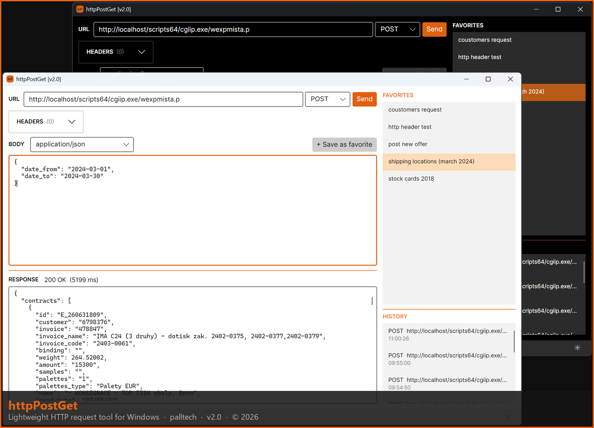

# httpPoster

A lightweight HTTP request tool for Windows. Send XML and JSON requests, manage favorites and history — clean and simple.

---

## Features

- Send HTTP requests — GET, POST, PUT, DELETE, PATCH
- Custom headers
- Favorites — save and organize frequently used requests
- Request history
- Automatic formatting of XML and JSON responses
- Dark and light theme

---

## Download

### v1.0

| Variant | Size | Requirements |
|---|---|---|
| [httpPoster-v1.0-standalone.exe](../../releases/download/v1.0/httpPoster-v1.0-standalone.exe) | ~49 MB | None — runs on any Windows 10/11 x64 |
| [httpPoster-v1.0-dependent.exe](../../releases/download/v1.0/httpPoster-v1.0-dependent.exe) | ~10 MB | [.NET 9 Runtime](https://dotnet.microsoft.com/en-us/download/dotnet/9.0/runtime) |

> **Not sure which to pick?** Download the standalone version — it works out of the box with no extra installation.

---

## Requirements

- Windows 10 or 11 (x64)
- Standalone version: nothing extra needed
- Dependent version: [.NET 9 Desktop Runtime](https://dotnet.microsoft.com/en-us/download/dotnet/9.0/runtime)

---

## License

MIT License — free to use and share.
See [LICENSE](LICENSE) for details.

---

## Support

If httpPoster saves you time, a coffee is always appreciated ☕

